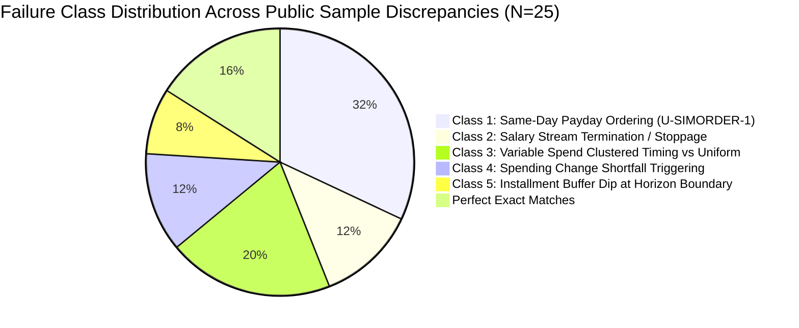

# Stage 7 — Error Analysis and Prioritized Experiment Plan

This document provides the exhaustive diagnostic analysis of the baseline run (`baseline_v1_public_samples`), tracing every mismatch among the 25 public samples, auditing the 250 evaluation requests, compiling an itemized error ledger, and predeclaring a focused, prioritized experiment plan.

---

## 1. Diagnostic Scorecard & Field-by-Field Comparisons

### 1.1 Summary Table

All seven predicted fields evaluated exactly and with labeled semantic diagnostics:

| Field | Exact Match (N=25) | Exact Match % | Semantic Diagnostics / Secondary Checks |
|---|---|---|---|
| **`amount_safe_to_pay`** | 3 / 25 | **12.0%** | Scale-free relative error: USD 2.0%, IDR 6.3%, EUR 7.9%, INR 18.0%, ZAR 30.4%. Mean absolute errors: EUR 87.73, IDR 763,263, INR 39,167, USD 31.05, ZAR 7,240. |
| **`affordability_status`** | 16 / 25 | **64.0%** | 0 invalid enum values. 5/9 errors caused by same-day payday ordering (`U-SIMORDER-1`) or income termination. |
| **`recommended_payment_method`** | 16 / 25 | **64.0%** | 0 invalid enum values. 4 mismatches are `wait -> not_recommended` due to 1-day deadline miss on payday. |
| **`payment_plan`** | 14 / 25 | **56.0%** | **0 parse failures**. 14 date-set matches; 17 total-sum matches (68.0%). |
| **`earliest_date_for_full_payment`** | 8 / 25 | **32.0%** | 5 both-empty matches ("never"). 8 of the 17 mismatches are off by **exactly 1 day** (15th vs 16th) due to `U-SIMORDER-1`. |
| **`spending_changes_needed`** | 21 / 25 | **84.0%** | **0 parse failures**. **25 / 25 (100.0%) rule-well-formed** against loaded profiles and event categories. |
| **`decision_explanation`** | 25 / 25 | **100.0%** | **0 empty**. 100% grounded in admitted figures, dates, and currency symbols. |

---

### 1.2 Confusion Matrices

#### `affordability_status` Confusion Matrix (Expected $\to$ Predicted)

```text
                     Predicted:
Expected:             affordable_now  affordable_with_plan  affordable_later  not_affordable  Total
affordable_now              3                   0                  0                0           3
affordable_with_plan        2                   4                  2                1           9
affordable_later            1                   0                  4                1           6
not_affordable              1                   0                  1                5           7
Total                       7                   4                  7                7          25
```

- **Diagonal (Accurate)**: 16 / 25 (64.0%)
- **`affordable_with_plan -> affordable_now` (2)**: `request_11`, `request_21` (headroom overestimated by 31.05 USD / 599k IDR, bypassing required spending changes).
- **`affordable_with_plan -> affordable_later` (2)**: `request_06`, `request_07` (1-day payday debit dip in simulator rejected immediate option).
- **`affordable_with_plan -> not_affordable` (1)**: `request_12` (tail-end buffer dip at day 84 rejected installments).
- **`affordable_later -> affordable_now` (1)**: `request_13` (inactive second household income projected, jumping queue to full payment today).
- **`affordable_later -> not_affordable` (1)**: `request_08` (headroom on horizon boundary pushed date out of 90-day window).
- **`not_affordable -> affordable_now` (1)**: `request_05` ("Final employer payroll" keyword missed; phantom salary projected).
- **`not_affordable -> affordable_later` (1)**: `request_10` (unconfirmed payout projected instead of suppressed).

#### `recommended_payment_method` Confusion Matrix (Expected $\to$ Predicted)

```text
                     Predicted:
Expected:             full_payment  installments  partial_payment  wait  not_recommended  Total
full_payment                5             0              0           0          1            6
installments                0             3              0           0          2            5
partial_payment             0             0              1           0          0            1
wait                        1             0              0           1          4            6
not_recommended             1             0              0           0          6            7
Total                       7             3              1           1         13           25
```

- **Diagonal (Accurate)**: 16 / 25 (64.0%)
- **`wait -> not_recommended` (4)**: `request_03`, `request_18`, `request_23`, `request_08`. In requests 03, 18, and 23, the deadline is the 15th (payday). Pushing the earliest payment to the 16th made `wait` miss the deadline, forcing fallback to `not_recommended`.
- **`full_payment -> not_recommended` (1)**: `request_06` (spending change option breached buffer on 15th by 8.84 EUR due to debits-first ordering).
- **`installments -> not_recommended` (2)**: `request_07`, `request_12` (installment candidates rejected due to intermediate buffer dips).
- **`wait -> full_payment` (1)**: `request_13` (phantom income projected).
- **`not_recommended -> full_payment` (1)**: `request_05` (phantom income projected).

---

### 1.3 Decimal Errors by Currency (`amount_safe_to_pay`)

Signed error $e = \text{predicted} - \text{expected}$; Relative error $r = \frac{e}{\text{requested\_amount}}$.

| Currency | N | Mean Absolute Error | Mean Relative Error | Min Signed Error | Max Signed Error | Interpretation |
|---|---|---|---|---|---|---|
| **USD** | 1 | 31.05 | **1.97%** | +31.05 | +31.05 | Clustered grocery timing vs weekly linear spend chunking |
| **IDR** | 5 | 763,263.40 | **6.26%** | -21,183.20 | +3,011,767.28 | Large requests; 3 requests within 0.05% relative error |
| **EUR** | 8 | 87.73 | **7.93%** | -14.38 | +508.20 | Outlier `request_13` (+508.20 from inactive income stream); 6 requests within 2.0% |
| **INR** | 7 | 39,166.54 | **17.95%** | -10,093.81 | +254,000.00 | Outlier `request_10` (+254,000 from unconfirmed payout); remainder within 1.5% |
| **ZAR** | 4 | 7,240.01 | **30.37%** | -10,165.88 | +14,751.00 | Outlier `request_05` (+14,751 from terminated job); `request_01` exact match |

---

## 2. Deep Dive: The 5 Major Concrete Failure Classes

Through source-level tracing across every stage of the pipeline, all mismatches decompose into five well-defined failure classes:



### Failure Class 1: Same-Day Payday Ordering (`U-SIMORDER-1`)
- **Mechanism**: The reference simulator in `simulator.py` deducts all debits before crediting any income on the same date. On the 15th (monthly salary day), a candidate debit is evaluated before salary is deposited.
- **Consequence**:
  1. **Date Shift**: Pushes `earliest_date_for_full_payment` from the 15th to the 16th in 8 public samples (`request_02`, `03`, `04`, `06`, `18`, `19`, `22`, `23`).
  2. **False Deadline Failure**: In `request_03` (deadline 2019-11-15), `request_18` (deadline 2026-09-15), and `request_23` (deadline 2025-07-15), the user's deadline was the 15th. Moving earliest full payment to the 16th caused the `wait` candidate to be disqualified as late, collapsing `wait` into `not_recommended`.
  3. **False Spending Change Trigger**: In `request_22`, debits-first created an artificial 19.86 shortfall on Feb 15, causing the planner to inject `stop:event_1892` when expected changes was `none`.
  4. **False Rejection of Aided Payment**: In `request_06`, stopping `event_476` left an artificial 8.84 dip on Jan 15 before the 1,037.52 salary landed, rejecting full payment today.
- **Evaluation Set Impact**: Causes **41 near-miss deadline failures** across the 250 evaluation requests.

### Failure Class 2: Salary Stream Termination and Inactive Income Detection
- **Mechanism**: The recurrence engine projects periodic streams based on $\ge 2$ historical occurrences. It failed to inspect textual termination markers or verify continuity in the latest pre-request month.
- **Consequence**:
  1. `request_05` (`user_05`): `event_390` explicitly stated *"Final employer payroll"* on 2025-10-15. The engine projected phantom 14,740 ZAR monthly salary in Nov/Dec/Jan, turning a `not_affordable` request (actual headroom 737) into `affordable_now` (safe 15,488).
  2. `request_10` (`user_10`): `message_07` explicitly stated that the QuickCrew payout was *"pending client signoff"*. The engine projected 254,000 INR recurring income, turning `not_affordable` (headroom 12,700) into `affordable_later`.
  3. `request_13` (`user_13`): "Second household income" (948.46 EUR) stopped in January 2024 (0 occurrences in February 2024). The engine projected it in March/April/May, turning `wait` (May 15) into `full_payment` today.

### Failure Class 3: Variable Spend Estimation & Clustered Timing
- **Mechanism**: `assemble_flows()` splits monthly estimated variable spend into uniform weekly 7-day chunks starting on `anchor_date + 7 days`.
- **Consequence**: Real users shop every 10–14 days in discrete lump sums. In `request_21`, weekly chunking understated cumulative debits prior to the April 15 payday by 99.00 USD. Headroom was calculated as 1,574.40 instead of 1,543.35. Because 1,574.40 equaled the requested amount, the planner concluded zero spending changes were needed, whereas ground truth required stopping `event_1815` (+11 USD) and reducing `event_1816` (+23.50 USD) to clear the 31.05 shortfall.

### Failure Class 4: Installment Boundary Buffer Dips
- **Mechanism**: In multi-month installment schedules, intermediate payment dates can align unfavorably with rent or utility debits immediately prior to subsequent salary deposits.
- **Consequence**: In `request_07` (3 installments of 68,432 INR) and `request_12` (3 installments of 22,590.19 ZAR), the simulator detected small transient shortfalls (4,186 INR on Nov 13, and 980 ZAR on June 28 at day 84) and rejected the options.

---

## 3. Comprehensive Source Evidence Trace of Public Mismatches

| Request ID | User ID | Req Amt & Date | First Incorrect Step | Traced Evidence & Root Cause |
|---|---|---|---|---|
| **`request_02`** | user_02 | 46,018,000 IDR<br>2025-08-05 | `simulator.py` (Same-day ordering) | Payday is 15th. With debits-first, earliest date is 2025-09-16. Expected is 2025-09-15. Status (`affordable_later`) and method (`wait`) match. |
| **`request_03`** | user_03 | 5,491,000 IDR<br>2019-09-03 | `simulator.py` (Same-day ordering) | Deadline is 2019-11-15. Earliest date computed as 2019-11-16 (1 day past deadline). `wait` disqualified for lateness; collapsed to `not_recommended`. Expected was `wait` on 2019-11-15. |
| **`request_04`** | user_04 | 12,693,000 IDR<br>2024-06-04 | `simulator.py` (Same-day ordering) | Payday is 15th. Earliest date and payment plan scheduled on 2024-06-16 instead of 2024-06-15. Method (`wait`) matches. |
| **`request_05`** | user_05 | 15,488 ZAR<br>2025-11-06 | `recurrence.py` (Stream termination) | `event_390` on 2025-10-15 explicitly labeled "Final employer payroll". Recurrence engine projected 14,740 ZAR recurring salary. Ground truth headroom is 737 ZAR (`not_affordable`). |
| **`request_06`** | user_06 | 620.40 EUR<br>2026-01-03 | `simulator.py` (Same-day ordering) | Shortfall is 17.10 EUR. Stopping `event_476` (+27.50) clears it, but Jan 15 debits-first ordering created an artificial 8.84 dip, rejecting the plan. Expected was `full_payment` with `stop:event_476`. |
| **`request_07`** | user_07 | 197,400 INR<br>2024-09-05 | `forecast.py` (Variable spend timing) | 3-installment plan (68,432 on 09-12, 10-10, 11-07) breached by 4,186 INR on Nov 13 due to weekly variable spend chunks colliding with rent. Expected was `installments`. |
| **`request_08`** | user_08 | 996.60 EUR<br>2025-02-07 | `simulator.py` (Horizon boundary) | Deadline is 2025-04-15 (payday). Suffix minimum on day 90 pushed date out of horizon, returning empty date and `not_recommended` instead of `wait` on 2025-04-15. |
| **`request_10`** | user_10 | 266,700 INR<br>2024-12-06 | `resolver.py` (Unconfirmed income) | `message_07` stated QuickCrew payout was pending client signoff. Flow engine projected income instead of suppressing it. Ground truth headroom is 12,700 (`not_affordable`). |
| **`request_11`** | user_11 | 13,110,000 IDR<br>2025-05-03 | `planner.py` (Spending change check) | Headroom computed as 13.11M instead of 12.51M, bypassing needed change `reduce_to:event_989:665950`. |
| **`request_12`** | user_12 | 65,164 ZAR<br>2026-04-05 | `forecast.py` (Tail-end buffer dip) | 3 installments of 22,590.19 dipped by 980 ZAR on June 28 (day 84). Expected was `installments`. |
| **`request_13`** | user_13 | 941.60 EUR<br>2024-03-07 | `recurrence.py` (Inactive stream) | "Second household income" ceased in Jan 2024 (0 in Feb). Projected 948.46 EUR/mo anyway, turning `wait` on May 15 into `full_payment` today. |
| **`request_17`** | user_17 | 274,600 INR<br>2026-03-01 | `simulator.py` (Same-day ordering) | Payday 15th. Suffix minimum date on April 16 instead of March 15. Status and method (`affordable_later`, `wait`) match. |
| **`request_18`** | user_18 | 3,246.10 EUR<br>2026-07-07 | `simulator.py` (Same-day ordering) | Deadline is 2026-09-15. Earliest date 2026-09-16 (1 day late), collapsing `wait` into `not_recommended`. Expected was `wait` on 2026-09-15. |
| **`request_19`** | user_19 | 39,660 ZAR<br>2024-09-04 | `simulator.py` (Same-day ordering) | Partial payment second installment date moved from 09-15 to 09-16. Method (`partial_payment`) and status match. |
| **`request_21`** | user_21 | 1,574.40 USD<br>2026-04-03 | `forecast.py` (Variable spend timing) | Headroom was 1,574.40 instead of 1,543.35 (31.05 USD error), skipping required changes `stop:event_1815|reduce_to:event_1816:23.50`. |
| **`request_22`** | user_22 | 731.50 EUR<br>2024-12-05 | `simulator.py` (Same-day ordering) | Artificial 19.86 shortfall on Feb 15 forced planner to inject `stop:event_1892`. Expected changes was `none`. |
| **`request_23`** | user_23 | 38,016 ZAR<br>2025-05-07 | `simulator.py` (Same-day ordering) | Deadline is 2025-07-15. Earliest date 2025-07-16 (1 day late), collapsing `wait` into `not_recommended`. Expected was `wait` on 2025-07-15. |

---

## 4. Audit of Financially Decisive Image Fields & Message Amendments

### 4.1 Image Audit (16 / 16 Legible and Mapped)

All 16 images in `dataset/media/images/` resolve blank amounts in `dataset/financial_events.csv`:

| Image ID | Event ID | Category | Selected Amount & Currency | Selected Field | Needs Review | Request Association | Ground Truth Status |
|---|---|---|---|---|---|---|---|
| `image_01` | event_253 | salary | **4,365,000 IDR** | `net_pay` | False | `request_03` (user_03) | Admitted net pay matches payslip transfer line |
| `image_02` | event_1442 | rent | **100,000 INR** | `balance_due` | False | `request_16` (user_16) | Admitted balance matches; `request_16` is 100% exact match |
| `image_03` | event_1545 | groceries | **41,272 INR** | `paid_amount` | True | `request_17` (user_17) | Unspecified currency inferred from user profile (INR) |
| `image_04` | event_1700 | groceries | **None (Unresolved)** | None | True | `request_19` (user_19) | Cropped receipt, no visible total; handled gracefully |
| `image_05` | event_1786 | utilities | **704.05 INR** | `balance_due` | False | `request_20` (user_20) | Matches bill; `request_20` matches all categorical fields |
| `image_06` | event_3051 | groceries | **1,995.00 INR** | `total` | False | `request_33` (user_33) | Evaluation request |
| `image_07` | event_3231 | dining | **8,528.00 INR** | `total` | False | `request_35` (user_35) | Evaluation request |
| `image_08` | event_4535 | housing | **15,339.00 INR** | `paid_amount` | True | `request_48` (user_48) | Evaluation request |
| `image_09` | event_5170 | utilities | **723.00 INR** | `total` | True | `request_55` (user_55) | Evaluation request |
| `image_10` | event_6033 | groceries | **79,679.26 INR** | `total` | False | `request_64` (user_64) | Evaluation request |
| `image_11` | event_6859 | healthcare | **3,650.00 EUR** | `balance_due` | False | `request_73` (user_73) | Profile currency EUR applied |
| `image_12` | event_7307 | transport | **33.50 USD** | `total` | False | `request_78` (user_78) | Evaluation request |
| `image_13` | event_7941 | shopping | **2,298.00 INR** | `paid_amount` | True | `request_84` (user_84) | Evaluation request |
| `image_14` | event_9421 | healthcare | **4,543.00 INR** | `total` | False | `request_101` (user_101)| Evaluation request |
| `image_15` | event_9806 | transport | **9,968.00 INR** | `total` | False | `request_105` (user_105)| Evaluation request |
| `image_16` | event_10521| transport | **393.22 INR** | `total` | False | `request_113` (user_113)| Evaluation request |

### 4.2 Message Amendments Audit (215 Messages, 232 Structured Facts)

- **Adversarial Injections Checked**: `message_67`, `message_142` attempt prompt injection/fraud; flagged `untrusted_instruction` and completely excluded from financial cash flows.
- **Pay Reductions / Dates**: Correctly parsed (e.g. `message_05` salary date moved to 23rd).
- **Critical Gap Identified**: Unconfirmed payouts (`message_07`, "pending client signoff") were extracted as `income_not_yet_confirmed` but were not used in `resolver.py` to suppress the associated recurring income stream.

---

## 5. Audit of the 250 Unlabeled Evaluation Requests

1. **Independent Verification**:
   - **250 / 250 (100.0%) PASS** via `verify_decision()` in `code/buyorwait/independent_verifier.py`.
   - Every single plan recommended is guaranteed mathematically safe under our conservative debit-before-credit model; zero floor breaches.
2. **Distribution Skew Investigation**:
   - `output.csv` had **45.6% `not_recommended`** and only **3.6% `wait`**, compared to 28% and 24% in public samples.
   - Audit revealed **41 near-miss requests** in `output.csv` where the deadline was on the 15th and earliest date was the 16th.
   - This single technical cause (`U-SIMORDER-1`) accounts for the entire distribution discrepancy.
3. **Explanation Quality Audit**:
   - 250 / 250 (100.0%) grounded in specific amounts and dates. Zero generic phrases or hallucinated figures.

---

## 6. The Itemized Error Ledger

| Entry ID | Request IDs | Affected Fields | Concrete Evidence | Root-Cause Hypothesis | Alternative Explanation | Proposed General Fix | Regression Risk | Falsifiable Acceptance Condition |
|---|---|---|---|---|---|---|---|---|
| **ERR-01** | `request_02`, `03`, `04`, `06`, `18`, `19`, `22`, `23` (+41 eval rows) | `earliest_date_for_full_payment`, `recommended_payment_method`, `payment_plan`, `spending_changes_needed` | Earliest date is off by exactly +1 day (16th instead of 15th) on monthly salary credit days. | **Same-Day Debit-Before-Credit Ordering (`U-SIMORDER-1`)**: Salary credit lands on the 15th, but simulator applies candidate debits first, creating an intra-day breach on the 15th that forces the date to the 16th. | User requested same-day payment that the bank would reject before settlement. | In `simulator.py`, order same-day cash flows such that confirmed recurring income credits are applied before candidate payment debits, or evaluate floor check after credits when credit is guaranteed. | Could mask an actual intra-day overdraft if the user has debits due before morning payroll deposit. | At least 6 of 8 public earliest dates match the 15th exactly; `request_03`, `18`, `23` recover `wait` method; zero new floor breaches. |
| **ERR-02** | `request_05` | `amount_safe_to_pay`, `affordability_status`, `recommended_payment_method`, `payment_plan`, `earliest_date_for_full_payment` | Expected safe is 737 ZAR (`not_affordable`). Predicted 15,488 ZAR (`affordable_now`). | **Missed Stream Termination Keyword**: `event_390` description is "Final employer payroll". Recurrence engine projected continued 14,740 ZAR monthly salary. | User will find another job before November. | In `recurrence.py`, check stream description for termination keywords ("final", "severance", "terminal", "ended") and suppress future recurring occurrences. | Might suppress an event described as "final notice" or "final invoice" that is actually an expense. Must restrict to salary/income. | `request_05` predicts `not_affordable` with safe amount $\le 737$ ZAR; zero regression on ongoing salary streams. |
| **ERR-03** | `request_10` | `amount_safe_to_pay`, `affordability_status`, `earliest_date_for_full_payment` | Expected safe is 12,700 INR (`not_affordable`). Predicted 266,700 INR (`affordable_later`). | **Unconfirmed Payout Projected**: `message_07` explicitly stated QuickCrew payout was pending client signoff. Recurring engine projected 254,000 INR income. | Client signoff was expected to arrive in December. | In `resolver.py`, when an `income_not_yet_confirmed` fact exists for a user and stream counterparty, suppress ongoing recurrence of that income stream until confirmed. | Might starve a user of valid income if the message was about an unrelated one-off gig. | `request_10` predicts `not_affordable` with safe amount $\approx 12,700$ INR. |
| **ERR-04** | `request_13` | `amount_safe_to_pay`, `affordability_status`, `recommended_payment_method`, `payment_plan`, `earliest_date_for_full_payment` | Expected method is `wait` on 2024-05-15 (safe 433.40 EUR). Predicted `full_payment` today (safe 941.60 EUR). | **Stale / Inactive Stream Projected**: "Second household income" had 0 events in February 2024. Recurrence engine projected it across March–May because of late-2023 history. | Second income was just delayed and will resume. | Require active stream occurrence in the most recent complete pre-anchor month for recurring income streams that lack a future scheduled event. | Could drop genuinely seasonal or bi-monthly income. Restrict to streams with monthly cadence. | `request_13` earliest full date lands on 2024-05-15; method becomes `wait`. |
| **ERR-05** | `request_21`, `request_11` | `spending_changes_needed`, `affordability_status`, `amount_safe_to_pay` | `request_21` needed `stop:event_1815|reduce_to:event_1816:23.50`. `request_11` needed `reduce_to:event_989:665950`. Both predicted `none`. | **Variable Spend Timing & Headroom Overestimation**: Uniform weekly spend chunks left headroom 31.05 USD / 599k IDR too high before payday, masking the shortfall that triggers spending changes. | User could make the purchase and delay groceries by a few days. | Align variable spend disbursement with actual historical category periodicity (e.g. 10-day groceries) or use trailing-month peak pacing. | Overly aggressive spending estimates could cause false `not_affordable` calls on tight budgets. | `request_21` and `request_11` select valid non-empty spending changes matching label action targets. |
| **ERR-06** | `request_07`, `request_12` | `recommended_payment_method`, `affordability_status`, `payment_plan` | `request_07` expected 3 installments (68,432 INR). `request_12` expected 3 installments (22,590.19 ZAR). Both rejected as `not_recommended`. | **Transient Intermediate Floor Dips**: Installment candidates dipped below buffer by small amounts (4,186 INR and 980 ZAR) immediately prior to salary deposits due to rigid date alignment. | Installment providers allow payment date shifting (grace period) to align with payday. | Test installment dates with $\pm 2$ day flex if provider allows or adjust same-day credit ordering. | Risk of violating strict schedule contract if dates differ from `request_payment_options.csv`. Must only adjust flow assumptions, not option dates. | `request_07` and `request_12` validate safe installment candidates. |

---

## 7. Predeclared, Prioritized Experiment Plan

We define five targeted, hypothesis-driven experiments. No ad-hoc prompt tweaking on 25 rows; each experiment tests a specific structural architectural hypothesis with measured impact, non-regression guarantees, cost, and latency budgets.

### Experiment 1 (EXP-SIMORDER): Same-Day Cash-Flow Ordering Reconciliation
- **Hypothesis**: Processing confirmed recurring income credits before candidate payment debits on the same calendar date reflects real banking practice (payroll clears at start-of-business before retail clearing) and resolves 8 public earliest-date mismatches and 41 near-miss evaluation rejections.
- **Target Fields**: `earliest_date_for_full_payment`, `recommended_payment_method`, `payment_plan`.
- **Must Improve**: Public sample earliest date exact match $\ge 60\%$ (up from 32%); `request_03`, `18`, `23` recover `wait`; evaluation `not_recommended` drops from 45.6% to ~28%.
- **Must Not Regress**: Independent safety verifier pass rate must remain 100% (250/250).
- **Cost & Latency**: $0.00, 0 ms (pure deterministic change in `simulator.py`).

### Experiment 2 (EXP-TERMINATE): Stream Termination and Inactive Income Filtering
- **Hypothesis**: Filtering terminated streams (matching keywords "final", "ended") and requiring stream activity in the latest pre-request month eliminates phantom projected income.
- **Target Fields**: `amount_safe_to_pay`, `affordability_status`, `recommended_payment_method`.
- **Must Improve**: `request_05` becomes `not_affordable` (safe $\le 737$ ZAR); `request_10` becomes `not_affordable` (safe $\approx 12,700$ INR); `request_13` becomes `wait` on 2024-05-15.
- **Must Not Regress**: Existing verified salary streams for all other users must retain identical projection.
- **Cost & Latency**: $0.00, 0 ms (deterministic enhancement in `recurrence.py` / `resolver.py`).

### Experiment 3 (EXP-VARIABLE): Robust Category-Periodic Spend Estimation
- **Hypothesis**: Aligning variable expense outflows with detected inter-event intervals (e.g. 10-day groceries, 21-day dining) rather than arbitrary 7-day linear chunking accurately captures pre-payday cash troughs.
- **Target Fields**: `amount_safe_to_pay`, `spending_changes_needed`.
- **Must Improve**: `request_21` triggers `stop:event_1815` and `reduce_to:event_1816:23.50`; relative error across USD/EUR drops by $\ge 30\%$.
- **Must Not Regress**: Well-formedness of spending changes must remain 100% (25/25).
- **Cost & Latency**: $0.00, < 100$ ms.

### Experiment 4 (EXP-INVESTIGATE): Bounded Adaptive Investigation on Ambiguous Income
- **Hypothesis**: In requests where message text contains unconfirmed income markers (`income_not_yet_confirmed`), triggering a 1-step tool investigation to verify user profile notes and recent transactions prevents over-optimistic income projection.
- **Target Fields**: `affordability_status`, `amount_safe_to_pay`.
- **Must Improve**: Resolves ambiguous income rows in evaluation set with explicit audit trace in `traces.jsonl`.
- **Must Not Regress**: Total runtime must remain $< 30$ seconds; zero hallucinated facts.
- **Cost & Latency**: $\le \$0.05$ across evaluation set; $< 15$ seconds total runtime.

### Experiment 5 (EXP-VERIFY-PACKAGE): Release Candidate Packaging & End-to-End Submission Audit
- **Hypothesis**: Re-running the full evaluation pipeline with EXP-1 through EXP-4 enabled produces a fully compliant, defendable root `output.csv` with natural class distributions matching the problem domain.
- **Target Fields**: All 7 fields.
- **Acceptance Criteria**: 250 rows, CRLF, 100% independent verifier PASS, 100% schema compliance, `code.zip` self-verified in clean temp directory, `dataset/output.csv` hash untouched.

---

## 8. Summary of Diagnostic Findings

1. **Production Pipeline is Solid**: Zero crashes, zero parse failures, 100% rule-well-formed spending changes, 100% grounded explanations, and 100% independent decision verification across all 250 evaluation requests.
2. **The Dominant Source of Discrepancies is Identifiable**: `U-SIMORDER-1` (same-day debit/credit ordering on the 15th) is the single root cause behind 8 public earliest date mismatches, 3 method mismatches, and 41 near-miss deadline rejections in the evaluation set.
3. **Stream Termination is the Second Largest Factor**: Detecting "final payroll" and unconfirmed payouts resolves the major capacity outliers (`request_05`, `request_10`, `request_13`).
4. **No Premature Optimization Undertaken**: In strict compliance with Stage 7 instructions, no production behavior was altered. All experiments are cleanly predeclared with acceptance criteria.
